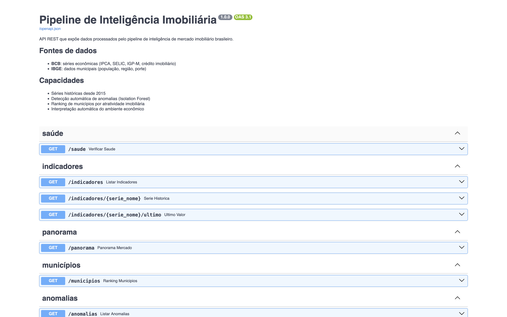
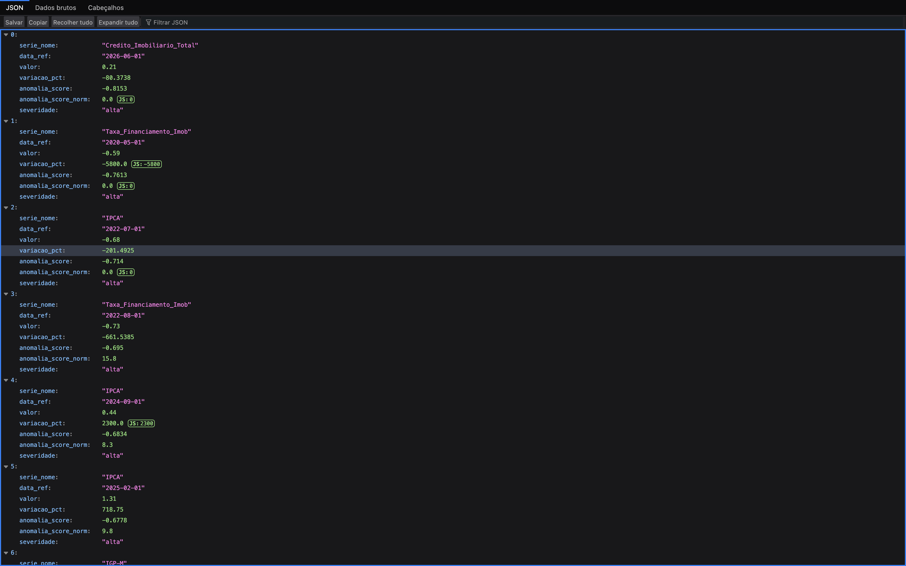
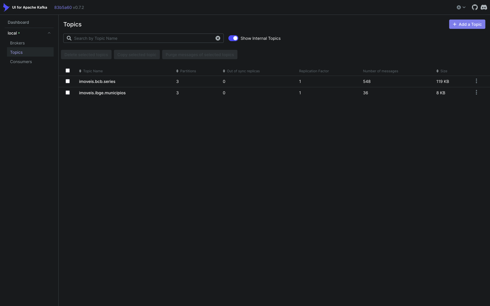
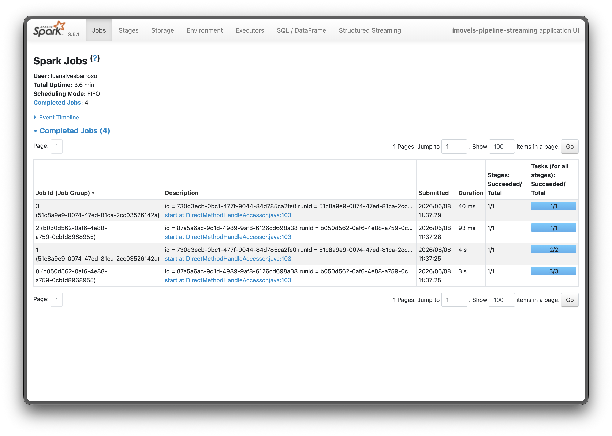
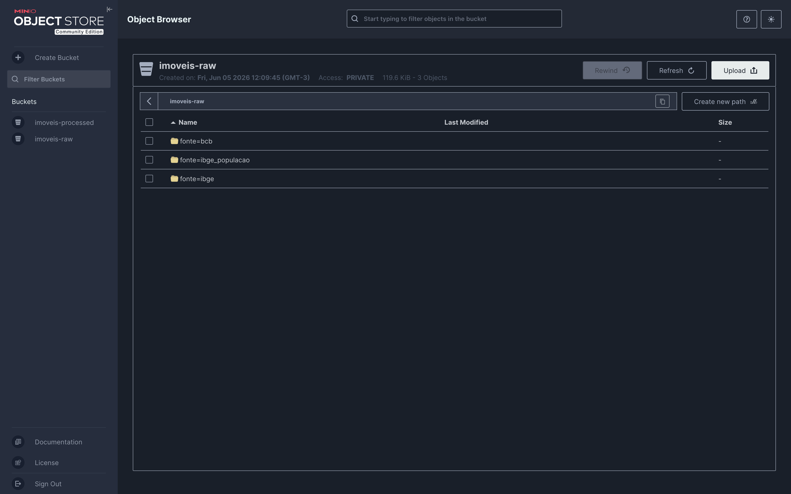
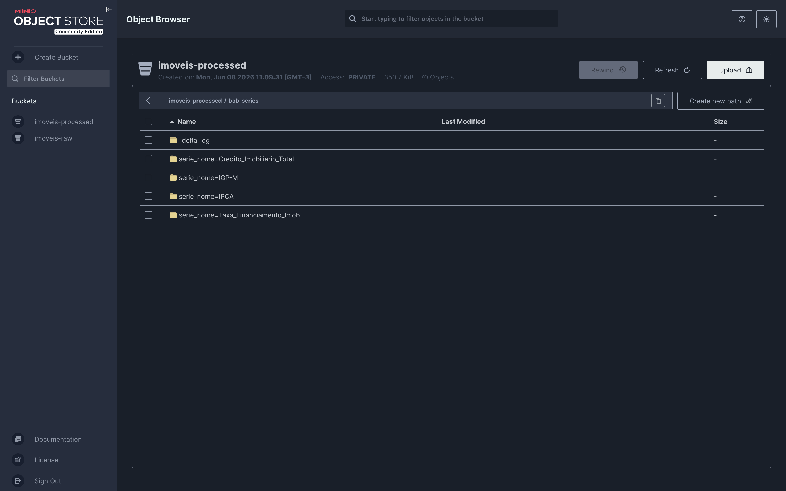
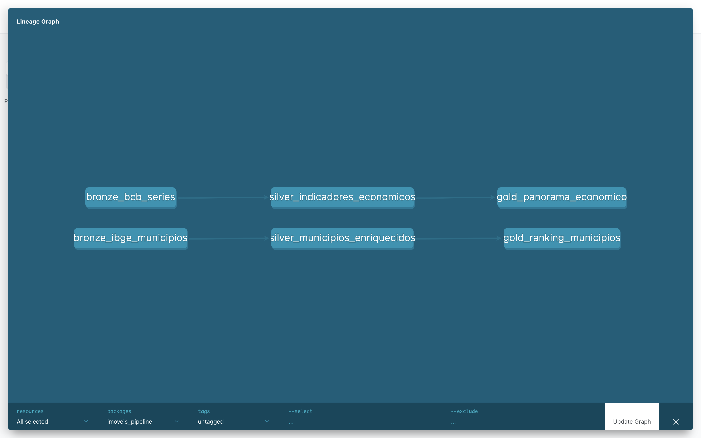

# 🏠 Pipeline de Inteligência Imobiliária

Pipeline completo de engenharia de dados para inteligência de mercado imobiliário brasileiro. O projeto coleta dados econômicos de APIs públicas, processa em tempo real com streaming, aplica machine learning para detecção de anomalias e expõe os resultados via API REST, simulando a arquitetura de uma plataforma proptech em produção.

---

## 📸 Visão Geral

### API REST - Swagger UI


### Anomalias detectadas pelo ML


### Kafka - Tópicos com mensagens


### Spark - Jobs concluídos


### MinIO - Bucket RAW (dados coletados)


### MinIO - Bucket Processed (Delta Lake)


### dbt - Grafo de linhagem


---

## 🏗️ Arquitetura

```
┌─────────────────────────────────────────────────────────────────┐
│                         COLETA                                  │
│  Scrapy → APIs BCB + IBGE → MinIO (imoveis-raw / JSONL)        │
└───────────────────────────┬─────────────────────────────────────┘
                            │
┌───────────────────────────▼─────────────────────────────────────┐
│                        STREAMING                                │
│  Producer Python → Kafka (imoveis.bcb.series /                 │
│                           imoveis.ibge.municipios)             │
└───────────────────────────┬─────────────────────────────────────┘
                            │
┌───────────────────────────▼─────────────────────────────────────┐
│                      PROCESSAMENTO                              │
│  Spark Structured Streaming → Delta Lake → MinIO               │
│  (imoveis-processed / particionado por série e UF)             │
└───────────────────────────┬─────────────────────────────────────┘
                            │
┌───────────────────────────▼─────────────────────────────────────┐
│                     TRANSFORMAÇÃO                               │
│  dbt + DuckDB (httpfs)                                         │
│  Bronze → Silver → Gold                                        │
│  (lê Delta Lake direto do MinIO, sem cópia)                    │
└───────────────────────────┬─────────────────────────────────────┘
                            │
┌───────────────────────────▼─────────────────────────────────────┐
│                   MACHINE LEARNING                              │
│  Isolation Forest → detecção de anomalias em séries temporais  │
│  (IPCA, IGP-M, SELIC, crédito imobiliário)                     │
└───────────────────────────┬─────────────────────────────────────┘
                            │
┌───────────────────────────▼─────────────────────────────────────┐
│                        ENTREGA                                  │
│  FastAPI → 8 endpoints REST documentados (Swagger UI)          │
└─────────────────────────────────────────────────────────────────┘
```

---

## 🛠️ Stack

| Camada | Ferramenta | Versão |
|---|---|---|
| Linguagem | Python | 3.12 |
| Coleta | Scrapy | 2.11.2 |
| Object Storage | MinIO (S3-compatible) | latest |
| Streaming | Apache Kafka | 7.6.0 |
| Processamento | Apache Spark | 3.5.1 |
| Storage format | Delta Lake | 3.2.0 |
| Transformação | dbt-duckdb | 1.8.1 |
| Banco analítico | DuckDB | 0.10.2 |
| Machine Learning | scikit-learn (Isolation Forest) | 1.4.2 |
| API REST | FastAPI + Uvicorn | 0.111.0 |
| Containerização | Docker + Docker Compose | - |

---

## ⚙️ Funcionalidades

### Coleta (Scrapy)
- Spider `bcb_series`: coleta 6 séries econômicas via API pública do Banco Central (IPCA, IGP-M, INPC, SELIC, Taxa de Financiamento Imobiliário, Crédito Imobiliário Total) com histórico desde 2015
- Spider `ibge_municipios`: coleta dados geográficos e demográficos de 18 municípios brasileiros via API IBGE
- Armazena em MinIO em formato JSONL com particionamento Hive-style (`fonte=/ano=/mes=/dia=`)

### Streaming (Kafka)
- Producer Python lê os arquivos JSONL do MinIO e publica mensagens nos tópicos `imoveis.bcb.series` e `imoveis.ibge.municipios`
- Cada tópico com 3 partições para processamento paralelo
- Mensagens roteadas por chave para garantir ordenação por série/município

### Processamento (Spark Structured Streaming)
- Consome os tópicos Kafka em micro-batches contínuos
- Aplica schema enforcement, limpeza e transformações
- Persiste em Delta Lake no MinIO com suporte a ACID e time travel
- Particionamento por `serie_nome/ano` e por `uf`

### Transformação (dbt)
- Camada **Bronze**: views sobre os arquivos Parquet do Delta Lake (leitura direta via DuckDB httpfs, sem cópia)
- Camada **Silver**: variações calculadas, tendências, enriquecimento de municípios, classificação por porte e perfil de mercado
- Camada **Gold**: panorama econômico com interpretação automática por indicador, ranking de municípios por atratividade imobiliária
- 12 testes de qualidade de dados

### Machine Learning (Isolation Forest)
- Modelo treinado por série econômica (uma instância por indicador)
- Detecção de anomalias com `contamination=0.05` (5% esperado)
- Score normalizado 0–100 com classificação de severidade (alta/média/baixa)
- Detectou eventos reais: deflação do IPCA em julho/2022, pico do IGP-M em maio/2021, corte emergencial de juros em maio/2020

### API REST (FastAPI)
| Endpoint | Descrição |
|---|---|
| `GET /saude` | Status da API e conectividade com o banco |
| `GET /indicadores` | Lista todos os indicadores com último valor |
| `GET /indicadores/{serie}` | Série histórica completa com filtros por ano |
| `GET /indicadores/{serie}/ultimo` | Último valor disponível |
| `GET /panorama` | Visão consolidada com interpretação para mercado imobiliário |
| `GET /municipios` | Ranking de municípios com filtros por região e UF |
| `GET /anomalias` | Anomalias detectadas pelo ML com filtros |
| `GET /anomalias/resumo` | Resumo agregado por série |

---

## 📁 Estrutura do Projeto

```
imoveis-pipeline/
├── docker-compose.yml          # MinIO + Kafka + Zookeeper + Kafka UI + Spark
├── requirements.txt
├── .env
├── scraper/
│   └── imoveis/
│       ├── spiders/
│       │   ├── bcb_spider.py       # Banco Central do Brasil
│       │   └── ibge_spider.py      # IBGE municípios
│       ├── items.py
│       ├── pipelines.py            # Pipeline MinIO
│       └── settings.py
├── streaming/
│   └── producer.py             # Kafka producer (MinIO → Kafka)
├── processing/
│   └── spark_consumer.py       # Spark Streaming (Kafka → Delta Lake)
├── dbt/
│   └── imoveis_pipeline/
│       └── models/
│           ├── bronze/             # Views sobre Delta Lake
│           ├── silver/             # Regras de negócio
│           └── gold/               # Visões analíticas
├── ml/
│   ├── anomaly_detector.py     # Isolation Forest
│   ├── models/                 # Modelos treinados (.pkl), não versionado
│   └── output/                 # Relatórios JSON, não versionado
├── api/
│   ├── main.py                 # FastAPI app
│   ├── routers.py              # Endpoints por domínio
│   ├── schemas.py              # Modelos Pydantic
│   └── database.py             # Conexão DuckDB
└── docs/
    └── prints/                 # Screenshots do projeto
```

---

## 🚀 Como Executar

### Pré-requisitos
- Docker Desktop
- Python 3.12
- Git

### 1. Clone o repositório

```bash
git clone https://github.com/luanbalves/imoveis-pipeline.git
cd imoveis-pipeline
```

### 2. Configure o ambiente Python

```bash
python -m venv .venv
source .venv/bin/activate
pip install -r requirements.txt
```

### 3. Configure o perfil dbt

Adiciona em `~/.dbt/profiles.yml`:

```yaml
imoveis_pipeline:
  target: dev
  outputs:
    dev:
      type: duckdb
      path: /caminho/para/imoveis-pipeline/data/imoveis_pipeline.duckdb
      threads: 4
      extensions:
        - httpfs
      settings:
        s3_endpoint: "localhost:9000"
        s3_access_key_id: "minioadmin"
        s3_secret_access_key: "minioadmin"
        s3_use_ssl: false
        s3_url_style: "path"
```

### 4. Suba a infraestrutura

```bash
docker compose up -d
```

Serviços disponíveis:
- **MinIO Console** → http://localhost:9001 (minioadmin / minioadmin)
- **Kafka UI** → http://localhost:8090
- **Spark UI** → http://localhost:8080

### 5. Execute o pipeline completo

```bash
# 1. Coleta os dados
cd scraper/imoveis
scrapy crawl bcb_series
scrapy crawl ibge_municipios
cd ../..

# 2. Publica no Kafka
python streaming/producer.py

# 3. Processa com Spark (aguarda alguns segundos e encerra com Ctrl+C)
python processing/spark_consumer.py

# 4. Transforma com dbt
cd dbt/imoveis_pipeline
dbt run && dbt test
cd ../..

# 5. Detecta anomalias com ML
python ml/anomaly_detector.py

# 6. Sobe a API
uvicorn api.main:app --port 8000
```

Acessa a documentação da API em **http://localhost:8000/docs**

---

## 💡 Decisões Técnicas

**Por que MinIO em vez de S3?** MinIO é 100% compatível com a API do S3, o código de produção não muda, só as credenciais. Permite desenvolver e demonstrar arquitetura cloud sem custo.

**Por que Kafka em vez de ingestão direta?** Desacopla produtores de consumidores. Se o Spark estiver lento, o Scrapy continua coletando sem perda de dados. Permite múltiplos consumidores independentes da mesma fonte.

**Por que Delta Lake em vez de Parquet puro?** Delta adiciona transações ACID, schema evolution e time travel sobre Parquet. Em produção com múltiplos jobs escrevendo simultaneamente, isso evita corrupção de dados.

**Por que DuckDB lendo direto do MinIO?** Elimina a necessidade de mover dados entre camadas. O dbt consulta os arquivos Parquet no object storage via extensão httpfs, mesmo padrão usado com S3 + Athena ou BigQuery em produção.

**Por que Isolation Forest para anomalias?** Algoritmo não supervisionado que não precisa de dados rotulados. Eficiente em séries temporais e robusto a variações de escala entre indicadores.

---

## 📄 Licença

MIT